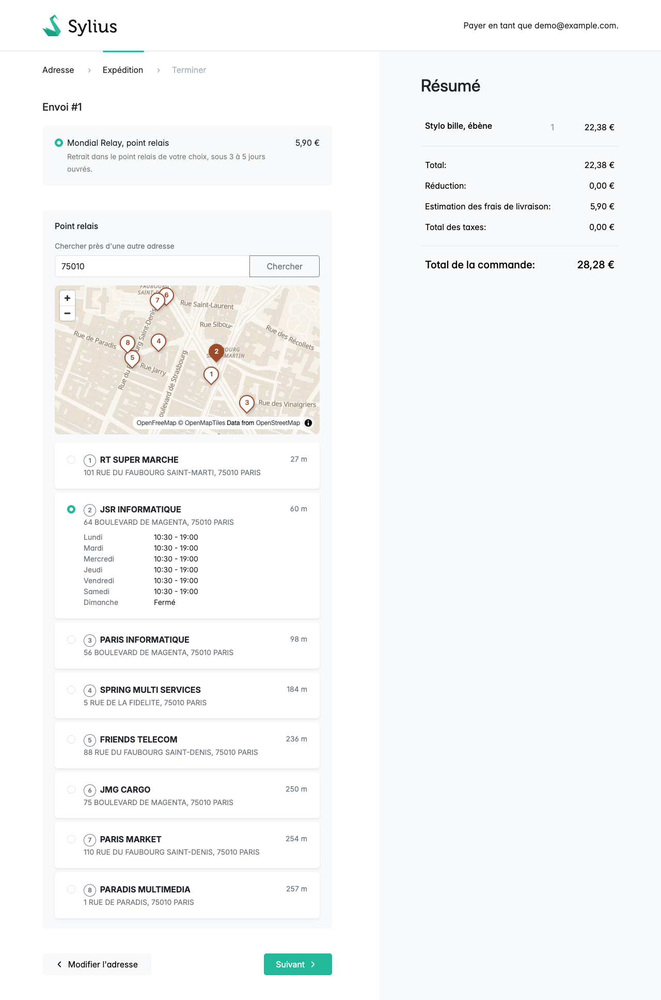
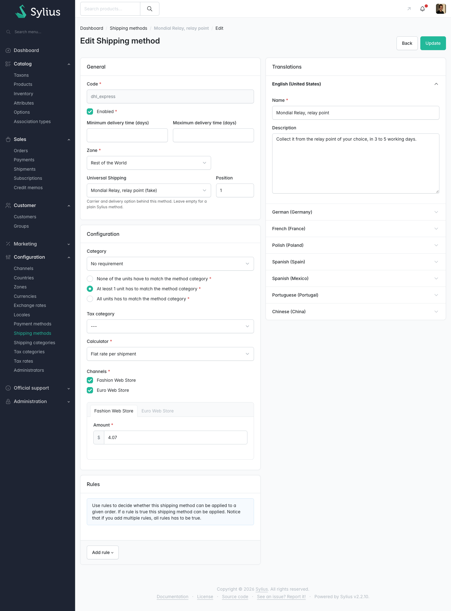
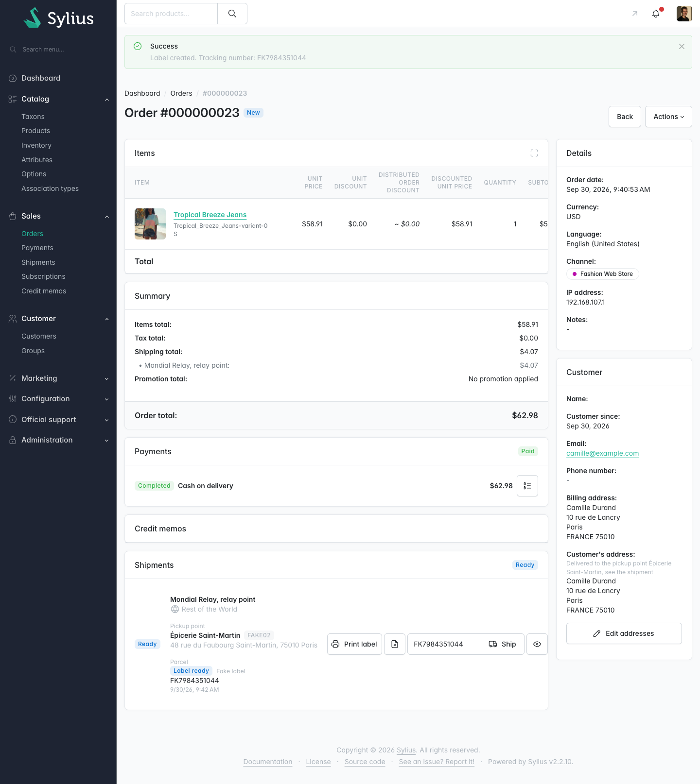

# Universal Shipping for Sylius

[](https://github.com/mahoudeau/universal-shipping-for-sylius/actions/workflows/ci.yaml)
[](LICENSE)

Shipping carriers for Sylius 2, starting with the part every French shop asks
for first: letting the customer pick a Mondial Relay point at checkout.



Currently **0.1**, built alongside a small French shop that will be its first
production user. What changed, and when: [CHANGELOG.md](CHANGELOG.md).

> **Independent project.** Not affiliated with, endorsed by, or connected to
> Sylius, Sendcloud or Mondial Relay. "Sylius" is used here only to say what
> this plugin is for.

## Status

What has been checked, and how far. Updated as each item moves.

**Checked against the real services**, in the shop that runs it (Sylius 2.2,
PHP 8.4, MariaDB 11.8):

- relay points from Sendcloud's live API: search, distance, opening hours, the
  chosen point saved on the shipment
- a relay point required before the order can go on
- the map, and choosing a point from its pins
- French address suggestions from the BAN, and the relay search centred on them

**Covered by unit tests, not yet run against the real Sendcloud:**

- labels: create, print, cancel, and the house number sent apart
  ([#1](https://github.com/mahoudeau/universal-shipping-for-sylius/issues/1))
- tracking by webhook
  ([#2](https://github.com/mahoudeau/universal-shipping-for-sylius/issues/2))

**Not tried yet:** PostgreSQL
([#3](https://github.com/mahoudeau/universal-shipping-for-sylius/issues/3)), a shop
with several channels
([#4](https://github.com/mahoudeau/universal-shipping-for-sylius/issues/4)),
addresses outside France.

CI runs the unit tests on PHP 8.2, 8.3 and 8.4, with Sylius 2.1.15 and the
latest 2.x.

**Configuration** is in YAML and environment variables, not in the admin: the
carrier keys, test labels and delivery options. The admin only links a shipping
method to a delivery option. An admin settings page is planned
([#5](https://github.com/mahoudeau/universal-shipping-for-sylius/issues/5)).

## What it does today

- **A pickup point picker in the checkout's shipping step.** Choose a method
  that needs a point and the nearest ones appear, with their address, distance
  and opening hours. Type another postcode and the list follows.
- **Mondial Relay through Sendcloud.** Relay points only, or lockers only, or
  both: one setting per delivery option.
- **The chosen point is kept on the shipment**, and shown on the checkout
  summary, the customer's order page and the admin order page, with the
  carrier's own point number for the drop-off.
- **An optional map** next to the list, drawn with MapLibre on OpenStreetMap
  data. Click a pin, the point is chosen. Free map sources only, and the
  checkout works the same without it.
- **Labels from the admin order page.** Create, print, and cancel while the
  carrier doesn't have the parcel yet. The tracking number goes into Sylius's
  own tracking field, so the "shipped" email carries it. Not yet run against
  the real Sendcloud: see [Status](#status).
- **Tracking by webhook.** The order shows where the parcel is: label ready,
  in transit, at the pickup point, delivered. Not yet run against the real
  Sendcloud either.
- **Optional French addresses** from the national address base (BAN):
  suggestions under the street fields at checkout, and a relay search centred
  on the customer's actual door.
- **A fake provider** with four fixed points and test labels, for demos,
  themes and tests without carrier credentials.
- **English and French** out of the box.

Colissimo comes next. See the [roadmap](#roadmap).

## Why another shipping plugin

When this started, in September 2026, there was no maintained Mondial Relay
integration for Sylius 2. The existing plugins stop at Sylius 1, and the one
Sylius 2 plugin we tried did not work with the 2.2 checkout. French shops also
increasingly reach
Mondial Relay through Sendcloud rather than the carrier's own API, which none
of them covered.

So this plugin is carrier-neutral from the start. Mondial Relay through
Sendcloud is the first provider, not the whole design. Adding a carrier means
writing one class.

## How it works

A few choices worth knowing before you install it:

- **The picker needs no JavaScript.** Sylius 2 renders the shipping step as a
  live component, so the picker is a plain Symfony form that re-renders on the
  server. Choosing a method, searching an address and picking a point all
  work without a line of custom JS. The optional map and address suggestions
  are the only scripts, and both only add to a form that works without them.
- **The list of points is always built on the server.** The browser only ever
  sends back the id of a point from that list, so a customer cannot forge a
  point or an address.
- **The point is copied onto the shipment, not referenced.** The address on
  the order stays what the customer chose, even if the carrier moves or closes
  the point later. A saved point is checked again with the carrier before it
  is offered a second time.
- **A carrier outage never breaks the checkout.** Searches are cached (the
  checkout re-renders on every change), providers are only loaded when a
  method needs them, and a failing carrier shows "no point found" and a log
  line instead of an error page.

One more thing, found on the way: Sylius declares its shipping step as a live
component but its template never switches it on in the browser. This plugin
replaces that one template with a fixed copy. It is the only core template it
touches.

## Requirements

- PHP 8.2 or later
- Sylius 2.1 or later (developed and used on 2.2)
- A Sendcloud account with an API integration and a sender address, for the
  Sendcloud provider

## Installation

**1. Require the package**

```sh
composer require mahoudeau/universal-shipping-for-sylius
```

**2. Enable the bundle** in `config/bundles.php`, if Flex did not:

```php
Mahoudeau\UniversalShipping\UniversalShippingPlugin::class => ['all' => true],
```

**3. Add the fields to your entities.** The point and the parcel live on the
shipment, the delivery option on the shipping method.

```php
// src/Entity/Shipping/Shipment.php
use Mahoudeau\UniversalShipping\Model\ParcelAwareInterface;
use Mahoudeau\UniversalShipping\Model\ParcelAwareTrait;
use Mahoudeau\UniversalShipping\Model\PickupPointAwareInterface;
use Mahoudeau\UniversalShipping\Model\PickupPointAwareTrait;

#[ORM\Index(columns: ['universal_shipping_parcel_id'], name: 'IDX_universal_shipping_parcel_id')]
class Shipment extends BaseShipment implements PickupPointAwareInterface, ParcelAwareInterface
{
    use ParcelAwareTrait;
    use PickupPointAwareTrait;
}
```

Leave out `ParcelAwareInterface` if you only want the picker: the label
buttons then stay hidden. The index is for the tracking webhook, which looks a
shipment up by its parcel id.

```php
// src/Entity/Shipping/ShippingMethod.php
use Mahoudeau\UniversalShipping\Model\DeliveryOptionAwareInterface;
use Mahoudeau\UniversalShipping\Model\DeliveryOptionAwareTrait;

class ShippingMethod extends BaseShippingMethod implements DeliveryOptionAwareInterface
{
    use DeliveryOptionAwareTrait;
    // ...
}
```

Then generate and run the migration. It adds nullable columns only:
`universal_shipping_pickup_point`, `universal_shipping_parcel` and
`universal_shipping_parcel_id` on `sylius_shipment`, and
`universal_shipping_delivery_option` on `sylius_shipping_method`.

```sh
bin/console doctrine:migrations:diff
bin/console doctrine:migrations:migrate
```

**4. Import the routes** in `config/routes/universal_shipping.yaml`. The label
buttons go under the admin prefix, so the admin firewall guards them. The
webhook goes without a prefix: carriers call it, not people. The shop routes
serve the checkout's scripts (only address suggestions for now) and don't
depend on the locale.

```yaml
universal_shipping_admin:
    resource: '@UniversalShippingPlugin/config/routes/admin.yaml'
    prefix: '/%sylius_admin.path_name%'

universal_shipping_webhooks:
    resource: '@UniversalShippingPlugin/config/routes/webhooks.yaml'

universal_shipping_shop:
    resource: '@UniversalShippingPlugin/config/routes/shop.yaml'
```

Leave the shop routes out and address suggestions stay off, whatever the
config says. Nothing else breaks.

**5. Declare your delivery options** in `config/packages/universal_shipping.yaml`.
A delivery option is one way of delivering with one carrier. The Sylius
shipping method on top of it adds the price, the zone and the name customers
see.

```yaml
universal_shipping:
    sendcloud:
        public_key: '%env(SENDCLOUD_PUBLIC_KEY)%'
        secret_key: '%env(SENDCLOUD_SECRET_KEY)%'
    delivery_options:
        mondial_relay_point_relais:
            label: 'Mondial Relay, relay point'
            provider: sendcloud
            carrier: mondial_relay
            delivery: pickup_point
            options:
                point_types: [servicepoint]   # Sendcloud also returns lockers
                shipping_option: 'mondial_relay:service_point,dualapi/size=l,c2c'   # for labels
```

The keys come from the Sendcloud panel: **Settings > Connected stores >
Sendcloud API**. Turn on pickup point delivery there and tick the carriers you
want. Keep the keys out of the repository.

**6. Link a shipping method** in the admin: edit it and choose the delivery
option in the **Universal Shipping** field. That method now asks for a point
at checkout.



## Configuration reference

```yaml
universal_shipping:
    cache_ttl: 600                    # seconds a search stays cached
    address:
        enabled: false                # see Addresses below
        provider: ban                 # or the id of your own AddressProviderInterface service
        url: 'https://data.geopf.fr/geocodage'
        autocomplete: true            # suggestions under the checkout's street fields
        geocode_pickup_search: true   # search pickup points around the geocoded address
        cache_ttl: 86400              # seconds an address answer stays cached
    labels:
        weight_unit: kg               # unit of the weights on your product variants
        default_weight: 0.5           # parcel weight when no product has one
    sendcloud:
        public_key: ''
        secret_key: ''                # also checks the webhook's signature
        test_labels: false            # true: every label is a free "Unstamped letter"
        sender_address_id: ~          # only needed with several sender addresses
        paper_size: ~                 # A4, A5 or A6; ~ keeps the carrier's size
        service_points_url: 'https://servicepoints.sendcloud.sc/api/v2'
        api_url: 'https://panel.sendcloud.sc/api/v3'
    delivery_options:
        <code>:                       # what the admin links a method to
            label: ~                  # shown in the admin
            provider: ~               # sendcloud, fake, or your own
            label_provider: ~         # makes the labels, if not the provider
            carrier: ~                # e.g. mondial_relay
            delivery: pickup_point    # or home
            options: {}               # passed to the provider as is
```

Sendcloud options:

| Option | Default | Meaning |
|---|---|---|
| `point_types` | all | `servicepoint` for relay points, `locker` for lockers |
| `radius` | 5000 | search radius in metres |
| `limit` | 10 | how many points the customer sees |
| `shipping_option` | none | Sendcloud shipping option code for labels. `POST /api/v3/shipping-options` lists yours |
| `contract_id` | none | only when you have several contracts with the carrier |

To develop or test without credentials, point a delivery option at the fake
provider:

```yaml
when@test:
    universal_shipping:
        delivery_options:
            mondial_relay_point_relais:
                label: 'Mondial Relay (fake)'
                provider: fake
                carrier: mondial_relay
```

## The map

Off by default. Turn it on and pick where the map comes from:

```yaml
universal_shipping:
    map:
        enabled: true
        style: 'https://tiles.openfreemap.org/styles/positron'   # the default
```

`style` is the URL of any MapLibre style. Three free sources work well:

| Source | `style` | Notes |
|---|---|---|
| [OpenFreeMap](https://openfreemap.org) | `https://tiles.openfreemap.org/styles/positron` (or `liberty`, `bright`) | OpenStreetMap data, worldwide, no key, no account. The default |
| [IGN Géoplateforme](https://geoservices.ign.fr) | `https://data.geopf.fr/annexes/ressources/vectorTiles/styles/PLAN.IGN/standard.json` | The French state's map, open licence, no key. Best in France, thin elsewhere |
| [Protomaps](https://protomaps.com), self-hosted | a style whose source is `pmtiles://https://your-server/france.pmtiles` | One file on your own server or object storage: no third party at all |

MapLibre and PMTiles ship with the plugin (both BSD-3), so no script comes
from a CDN. MapLibre is only downloaded on a page that shows a map.

**Privacy.** With OpenFreeMap or IGN, the customer's browser loads map tiles
from their servers, so they see the customer's IP address. Say so in your
privacy policy, or self-host with Protomaps. The pickup point list itself
never talks to a third party from the browser: carrier calls happen on your
server.

**Theming.** Give the map your shop's colours:

```yaml
universal_shipping:
    map:
        theme:
            accent: '#9c4a2a'          # pins, and the chosen pin
            pin_text: '#fbf8f3'        # number on the chosen pin
            colors:                    # the map itself
                background: '#f5f0e8'
                buildings: '#eae1d3'
                roads: '#fbf8f3'
                parks: '#e4e7d8'
                water: '#d5ddd8'
                labels: '#6e604f'
```

Every key is optional: leave one out and the style keeps its own colour.
Colours must be `#rgb` or `#rrggbb`. The map colours apply to OpenMapTiles
styles, which covers OpenFreeMap and most free styles; other styles are only
partly recoloured. Street names keep the style's font, since the tile server
only has its own. For full control, design a style in
[Maputnik](https://maplibre.org/maputnik/) and point `style` at it.

## Addresses

Off by default. It uses the [Base Adresse Nationale](https://adresse.data.gouv.fr)
(BAN), France's official address base: free, open licence, no account, no key.

```yaml
universal_shipping:
    address:
        enabled: true
```

That turns on two things, each of which can be turned off alone:

- **Suggestions at checkout** (`autocomplete`). In the address step, typing
  in a street field lists matching addresses. Choosing one fills the street,
  postcode and city, for the shipping and the billing address. The list
  works with the keyboard and screen readers (the ARIA combobox pattern).
  Without JavaScript the form is the same as before. Needs the shop routes
  from installation step 4.
- **A relay search around the real address** (`geocode_pickup_search`). The
  customer's address is turned into coordinates first, and the carrier
  searches around them instead of guessing from the text. If the BAN finds
  nothing it trusts, or doesn't answer, the search goes out as text, as
  without the module.

It covers metropolitan France and the five overseas departments (Guadeloupe,
Martinique, Guyane, La Réunion, Mayotte). For any other country the street
field stays a plain field and the relay search stays as it was.

**Privacy.** The customer's browser only talks to your shop. Your server
asks the BAN, the same way carrier calls work. So the BAN sees your server's
address and what customers type in the street field, never their IP address
or anything else about them.

**Where the BAN lives.** Since 2025 it is served by the IGN Géoplateforme at
`https://data.geopf.fr/geocodage`, the default `url`. The older
`api-adresse.data.gouv.fr` was announced as closing in January 2026; don't
point `url` at it. The Géoplateforme allows 50 requests per second per IP
address. Answers are cached for a day, so a shop rarely gets near that, but
the suggestion route is public: put a rate limiter in front of
`/universal-shipping/address/suggest` if you expect abuse.

**Labels.** The house number goes to the carrier on its own, whatever this
setting: "12 bis rue de la Paix" becomes number "12 bis" and street "rue de
la Paix". A line without a leading number ("Lieu-dit Les Pins") stays whole.

**Theming.** The suggestion list reads Bootstrap's colours. Override them in
your CSS:

```css
.us-address-list {
    --us-address-accent: #9c4a2a;     /* bar on the active suggestion */
    --us-address-bg: #fbf8f3;
    --us-address-active-bg: #f5f0e8;
}
```

**Another source.** Implement `AddressProviderInterface` (`supports`,
`suggest`, `geocode`), register it as a service, and give its id as
`provider`. Throw `ProviderUnavailableException` when it can't be reached:
the plugin caches answers and turns outages into empty ones.

## Labels and tracking

A paid shipment that hasn't left yet gets a **Create label** button on the
admin order page, next to Sylius's **Ship**. It sends the carrier the
customer's address, the chosen point, the order total and the parcel's weight.
Then:

- **Print label** opens the PDF.
- The tracking number is already in Sylius's tracking field, so **Ship** sends
  the usual email with it.
- **Cancel label** voids it until the carrier has the parcel. The shipment can
  then get a new one.

Most carriers charge as soon as the label exists. Sendcloud refunds a label
cancelled within 42 days if the parcel never shipped.

Labels go through Sendcloud's shipments API v3. The older parcels API is
closed to accounts opened since April 2026.

**Test labels.** With `sendcloud.test_labels: true`, every label is
Sendcloud's free "Unstamped letter", sent to the customer's address instead of
the point. Same flow, nothing charged. Keep it on everywhere but production:

```yaml
universal_shipping:
    sendcloud:
        test_labels: '%env(bool:SENDCLOUD_TEST_LABELS)%'
```

**Fake labels.** No carrier account, or one you'd rather not touch? Give the
delivery option `label_provider: fake`. Points still come from the real
provider. Labels get a made-up tracking number and a PDF marked as a test.
You play the carrier from the console:

```yaml
when@dev:
    universal_shipping:
        delivery_options:
            mondial_relay_point_relais:
                label_provider: fake
```

```sh
bin/console universal-shipping:fake-tracking fake-3f9a1c2b7e ready_for_pickup
```

The parcel id is on the admin order page. The command won't touch a real
carrier's parcel.

**Tracking.** In Sendcloud, open **Settings > Integrations**, configure your
API integration, tick **Webhook feedback enabled** and enter:

```
https://your-shop.example/universal-shipping/webhooks/sendcloud
```

Sendcloud signs every call with your secret key. The plugin refuses the ones
that don't match, and an update that arrives late after a retry never
overwrites a newer one. The order page shows:

| Status | Means |
|---|---|
| Label ready | announced, the carrier has not scanned it yet |
| In transit | the carrier has it |
| At the pickup point | waiting for the customer |
| Delivered | handed over or collected |
| Returned | refused or sent back |
| Needs attention | failed delivery, invalid address, carrier exception |
| Cancelling, Cancelled | the label was voided |

The plugin never marks a shipment shipped on its own. That stays a click on
**Ship**, so the email goes out when you decide.

## Adding a carrier

Implement `PickupPointProviderInterface` and give it a code:

```php
use Mahoudeau\UniversalShipping\Provider\AsPickupPointProvider;
use Mahoudeau\UniversalShipping\Provider\PickupPointProviderInterface;

#[AsPickupPointProvider('my_carrier')]
final class MyCarrierProvider implements PickupPointProviderInterface
{
    public function search(PickupPointQuery $query, DeliveryOption $option): array { /* ... */ }

    public function find(string $id, DeliveryOption $option): ?PickupPoint { /* ... */ }
}
```

Autoconfiguration registers it. Throw `ProviderUnavailableException` when the
carrier cannot be reached, and the plugin takes care of the rest. The
[Sendcloud provider](src/Provider/Sendcloud/SendcloudPickupPointProvider.php)
is a complete example.

For labels, implement `LabelProviderInterface` with
`#[AsLabelProvider('my_carrier')]`: create a label, return its PDF, cancel it.
Throw `LabelException` with a message the shop owner can act on, since the
admin shows it word for word. A carrier without labels is fine, the buttons
just don't appear. For tracking, turn the carrier's webhook into a call to
`ParcelTracker::update()`, like the
[Sendcloud webhook](src/Controller/SendcloudWebhookController.php).



## Roadmap

Roughly in this order. Nothing here is promised by a date. Each item is an
issue, so you can follow it or add to it.

**First, check what is built:**

1. **Labels against the real Sendcloud**
   ([#1](https://github.com/mahoudeau/universal-shipping-for-sylius/issues/1)).
2. **Tracking webhooks from the real Sendcloud**
   ([#2](https://github.com/mahoudeau/universal-shipping-for-sylius/issues/2)).
3. **PostgreSQL**
   ([#3](https://github.com/mahoudeau/universal-shipping-for-sylius/issues/3)) and
   **several channels**
   ([#4](https://github.com/mahoudeau/universal-shipping-for-sylius/issues/4)).

**Then, build:**

4. **Carrier settings in the admin**: keys stored encrypted, test labels,
   paper size, with environment variables still winning when set
   ([#5](https://github.com/mahoudeau/universal-shipping-for-sylius/issues/5)).
5. **Delivery options editable in the admin**
   ([#6](https://github.com/mahoudeau/universal-shipping-for-sylius/issues/6)).
6. **Colissimo**, home delivery and point retrait. Sendcloud already offers
   both, so this is mostly a delivery option away
   ([#7](https://github.com/mahoudeau/universal-shipping-for-sylius/issues/7)).
7. **Home delivery and lockers** as first-class delivery options
   ([#8](https://github.com/mahoudeau/universal-shipping-for-sylius/issues/8)).
8. **Addresses outside France**, with a self-hosted
   [Photon](https://github.com/komoot/photon). French addresses are done
   ([#9](https://github.com/mahoudeau/universal-shipping-for-sylius/issues/9)).
9. **Labels for several orders at once**, and an option to mark a shipment
   shipped on the carrier's first scan
   ([#10](https://github.com/mahoudeau/universal-shipping-for-sylius/issues/10)).
10. **A shop API endpoint** for headless checkouts
    ([#11](https://github.com/mahoudeau/universal-shipping-for-sylius/issues/11)).
11. **Functional tests** of the whole checkout in a Sylius test application
    ([#12](https://github.com/mahoudeau/universal-shipping-for-sylius/issues/12)).

Want one of these sooner, or a carrier that is not on the list? Open an issue.

## Contributing

Contributions are welcome, from a typo to a carrier. See
[CONTRIBUTING.md](CONTRIBUTING.md) for how to run the checks and what a pull
request should look like.

## License

MIT. See [LICENSE](LICENSE).
